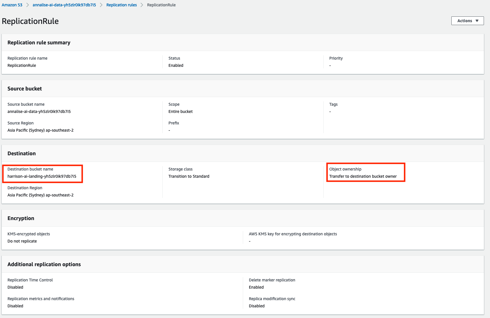
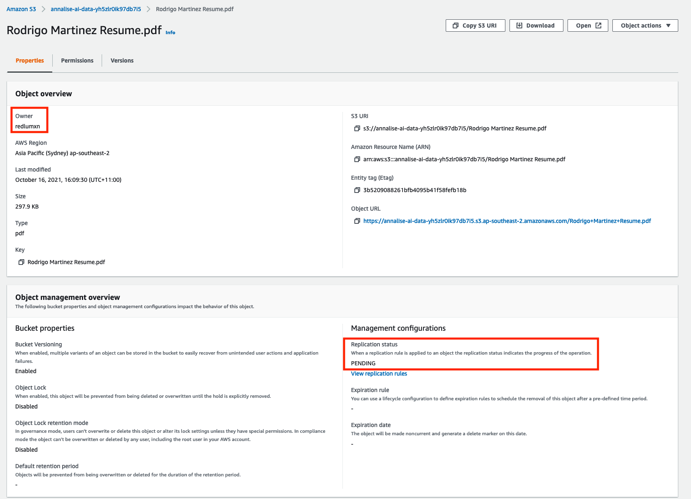
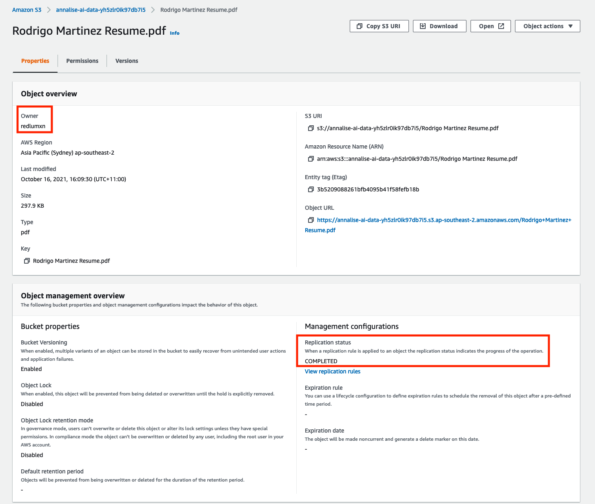
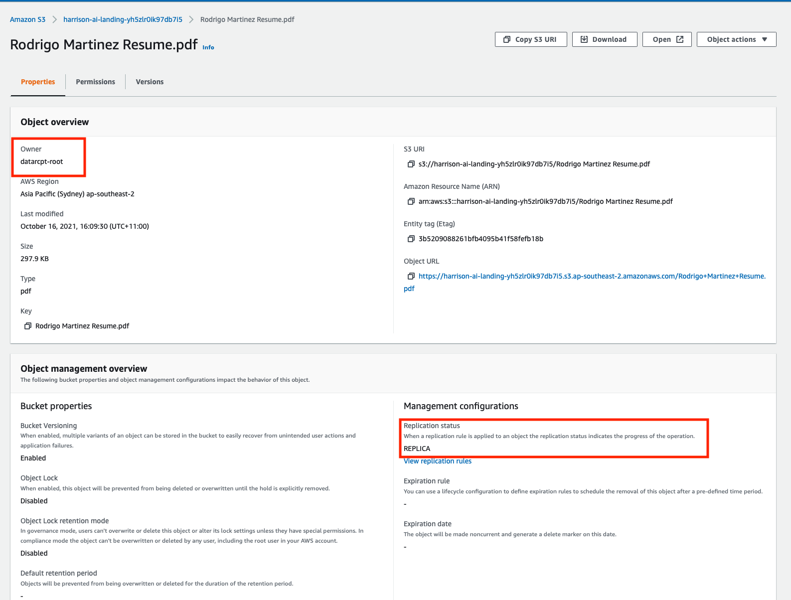

# Cross-Account S3 Object replication

Response to Harrison.ai Tech Task - [Question 1](https://github.com/harrison-ai/data-eng-sol-architect-tech-task/blob/main/README.md#question-one). 

## Description

In order to provide the object replication across buckects hosted in different AWS account, [S3 Object replication rules](https://docs.aws.amazon.com/AmazonS3/latest/userguide/replication.html) are leveraged. This allows the replicated obkjects to be fully owned by the destionation AWS account in addition to being a S3 feature that only requires to be configured (vs scripting or standing up additional services).

 The The Terraform files included in this repo create and configure the resources in the following accounts.
* Source Account: Annalise.ai
* Target Account: Harrissson.ai

The setup includes:
1. Setting bucket versioning
2. Modifying bucket policies
3. Creation of IAM Role in the source accoint with the required permissions (via policies)
4. Creattion of the bucket replication rule (in source bucket)

## Getting Started

### Dependencies

* [AWS CLI v2](https://docs.aws.amazon.com/cli/latest/userguide/install-cliv2.html)
* Terraform 1.0.9
* [tfenv](https://github.com/tfutils/tfenv) (optional)

### Installing requirements

```sh
$ brew install tfenv
$ tfenv install 1.0.9
$ tfenv use 1.0.9
```

Configure the AWS profiles to be used by each Terraform AWS provider in [local.tf](local.tf)
```
locals {
  region           = "ap-southeast-2"
  harrison_profile = "<CHANGE_ME>"
  annalise_profile = "<CHANGE_ME>"
}
```

### Creating the resources across AWS accounts

```sh
$ terraform init
$ terraform plan -out=tfplan
$ terraform apply tfplan 
```

### Sample Replication execution
#### Replication Rule (Source bucket)


#### Object Replication Pending (Source bucket)


#### Object Replication Completed (Source bucket)


#### Object Replication Completed (Destination Bucket)
